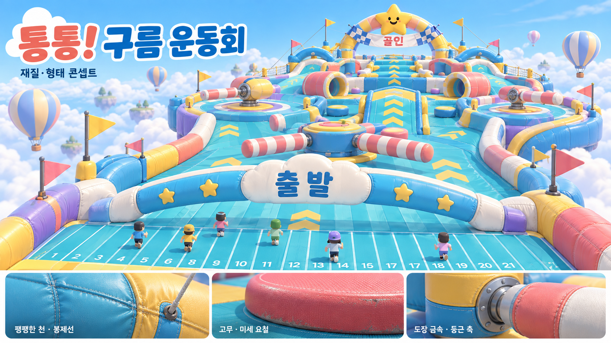

# 74차 경주 개편 계획 — 통통! 구름 운동회

상태: **계획·미술 콘셉트 단계. 게임 구현 전이며 실행 파일은 73차 그대로다.**

## 사용자가 정한 필수 기준

- 3학년 21명이 즐기는 폴가이즈 분위기의 창의적인 장애물 경주. 전체 코스 교체까지 허용한다.
- 상자를 쌓은 그래픽은 사용하지 않는다. 실제 곡면·두께·재료의 질감이 살아 있는 놀이시설을 만든다.
- 통통 튀고 붕 날아오르는 조작감, 현장감과 스릴을 중점으로 한다.
- 달리기·도약·활공감·미끄럼 가속의 속도감도 핵심이다. 단순한 최고속도 증가나 화면 흐림으로 대신하지 않는다.
- LG gram에서 기존 그래픽 수준과 성능을 유지한다. 낮은 해상도나 그림자로 비용을 감추지 않는다.
- 작업 완료 시 검증 후 GitHub 푸시와 바탕화면 `좀비의 밤` 업데이트를 함께 한다.

## 경험과 미술

하늘 위에 설치한 대형 공기 주입식 운동회다. 멀리서 보이는 별 모양 결승 아치가 방향을 알려준다. 청록·코랄·버터 노랑을 중심으로 라벤더 받침과 아이보리 여백을 사용한다. 바닥 화살표·구간 번호·장애물 움직임으로 길을 읽게 하며 장식과 실제 발판을 구별한다.

길 자체가 두꺼운 곡면 쿠션, 원형 발판, 튜브, 성형 고무 범퍼, 완만한 곡선 경사로다. 모서리만 둥글린 네모 블록이나 작은 상자 조합으로 형태를 대신하지 않는다. 비닐 코팅 천의 팽팽함·접합부 주름·봉제선, 고무의 미세 요철, 도장 금속 축의 광택과 볼트가 각각 구별되어야 한다.

이 이미지는 재질·실루엣·색의 목표다. 최종 코스 배치도나 실제 게임 렌더가 아니며 아래의 점프 연쇄 설계를 구현하면서 구성을 조정한다.

## 코스 — 7구간, 90초를 기준으로 조정

| 구간 | 주된 체험 | 미술·가독성 |
|---|---|---|
| 1. 구름 출발광장 | 21명이 넓게 출발하고 낮은 쿠션 하나에서 작은 첫 바운스를 경험 | 봉제 구름 아치, 넓은 3열 출발 공간, 진행 화살표 |
| 2. 통통 도넛섬 | 낮은 바운스 두 번→조금 큰 세 번째 점프로 리듬을 익힘 | 볼록한 원형 점프 매트, 두꺼운 도넛 착지 테두리 |
| 3. 빙글 캔디마당 | 낮은 회전봉을 뛰어넘거나 넓은 바깥길을 선택 | 줄무늬 고무 회전봉, 둥근 축·베어링, 원형 경기장 |
| 4. 출렁 구름다리 | 좌우로 움직이는 넓은 쿠션 발판 사이를 이동 | 관형 지지대와 부푼 천 패널, 이동 방향 표시 |
| 5. 붕붕 하늘항로 | 큰 발판에서 발사→넓은 중간 매트→두 번째 도약, 공중 방향 보정 | 착지점이 선명한 원형 표적, 길 옆 커다란 고리와 깃발 |
| 6. 무지개 미끄럼 | 굽은 내리막에서 점차 가속하며 쿠션 범퍼를 피하고 마지막 도약에 연결 | 연속 곡면 슬라이드, 진행 방향 줄무늬, 둥근 옆벽과 넓은 출구 |
| 7. 별빛 대도약 | 마지막 큰 바운스로 별 아치를 통과해 넓은 결승 매트에 착지 | 멀리서 보이는 별 아치, 결승 리본, 짧은 축하 효과 |

각 구간에 안전한 체크포인트를 둔다. 회복과 대기 구역 위로 장애물이 지나가지 않게 한다. 기본 코스는 정밀한 타이밍 없이도 도전 가능하고, 선택 지름길에서 역전할 기회를 준다. 실패 없이 약 55~65초를 초기 목표로 두고 실제 조작 시험으로 조정한다. 장애물 충돌과 친구끼리 가벼운 밀림은 유지하되 출발·복귀 지점의 혼잡으로 연속 추락하지 않게 한다.

전체 진행은 +Z 방향을 유지하면서 좌우로 넓게 갈라졌다 합쳐지는 구성을 사용한다. 실제 곡선 실루엣과 입체 높낮이로 공간을 설계한다. 급격한 U턴이나 카메라 자동 회전에 기대지 않는다.

## 바운스의 감각

1. 접촉: 매트가 짧게 눌리고 가장자리가 조금 부풀며 낮은 공기 소리가 난다.
2. 반발: 눌린 매트가 복원되는 순간 위쪽 속도를 주고 탄성 있는 소리를 맞춘다. 입력을 오래 막지 않는다.
3. 상승: 캐릭터는 무릎을 펴고 팔을 벌린다. 속도에 따라 바람 소리와 작은 시야각 변화가 이어진다.
4. 정점: 실제 탄도 운동이 잠시 느려 보이는 순간, 다음 착지점이 시야에 남는다. 게임 전체를 느리게 하지 않는다.
5. 착지: 무릎과 몸 중심이 짧게 내려갔다 복원되고 매트가 한 번 출렁인다. 연쇄 구간은 다음 점프로 자연스럽게 이어진다.

작은 통통 점프, 중간 도약, 결승의 큰 도약으로 강약을 둔다. 점프 충격량·거리는 기존 이동 속도와 중력에서 측정해 결정한다. 공중 조작은 작지만 분명하게 허용한다. 캐릭터 크기를 늘였다 줄여 모자·몸 겹침을 만들지 않는다. 카메라 yaw/pitch를 강제로 돌리거나 흔들어 스릴을 만들지 않는다. 같은 매트 접촉으로 여러 번 연속 발사되는 문제를 방지한다.

## 구현과 성능 기준

속도 리듬은 `달리기 → 짧은 바운스 연쇄 → 회피 → 큰 도약 → 미끄럼 가속 → 결승 대도약`이다. 슬라이드에서는 방향 조작과 감속 여유를 남긴다. 가까운 난간·구간별 바닥 무늬의 시차, 속도에 연동하는 바람 소리와 소폭의 부드러운 FOV 변화로 빠르게 느끼게 한다. 큰 카메라 뒤처짐, 급격한 FOV 변화, 모션 블러로 착지점을 가리지 않는다. 이 변화는 경주에만 적용하며 마을 이동은 유지한다.

- 전용 곡면 기하를 만들고 동일 모형은 인스턴싱한다. 정적 부분과 움직이는 부분을 나눈다.
- 현재 보통/선명 품질은 이미 Phong 재질을 사용한다. 공유 비닐·고무·도장 금속 재질 3개 이하를 초기 목표로 잡고, 가까운 소품에서 표면 차이를 먼저 검증한다.
- 경주용 표면·미세 요철 텍스처는 우선 512×512 두 장을 검토한다. RGBA 밉맵 포함 약 2.7MiB의 텍스처 예산이며 최종 해상도는 실제 화면과 비용으로 결정한다.
- 질감은 회전·이동하는 물체의 로컬 UV에 고정한다. 밉맵을 적용해 멀리서 봉제선과 무늬가 깜빡이지 않게 한다.
- 전체 화면 효과, 겹친 반투명 구름, 추가 실시간 조명, 무거운 강체/천 시뮬레이션을 늘리지 않는다. 매트 변형은 작고 제한된 탄성 모션으로 구현한다.
- 장애물은 공유 seed와 시간으로 위치가 정해지는 방식으로 만들고 장애물별 위치 전송을 추가하지 않는다. 개인의 바운스는 자신의 이동 물리로 처리한다. 누가 밟았는지에 따라 모두의 발판 위치가 바뀌는 공유 시소는 별도 설계 없이 넣지 않는다.
- 초기 렌더 예산은 추가 draw call 12회 이내, 동적 장애물 64개 이내. 숫자를 맞추는 것만으로 완료하지 않고 같은 조건의 기존 경주와 프레임 시간·메모리를 비교한다.
- 충돌 판정은 둥근 모형에 맞는 원/캡슐/선분을 사용한다. 눈에 보이지 않는 네모 모서리에 걸리면 안 된다.

## 제작 순서와 완료 기준

1. 기존 경주에서 21명·같은 카메라·같은 화질의 성능 기준과 화면을 남긴다.
2. **바운스 구간 하나를 실제 재질·곡면·캐릭터 자세·소리·카메라까지 완성**한다. 가까운 플레이 시점에서 미술과 조작감, 성능을 함께 평가한다.
3. 검증한 모형과 동작을 사용해 7구간을 연결하고 체크포인트·랭킹·기존 보상을 연결한다.
4. 30/60/120Hz, 여러 씨앗에서 실제 이동 함수로 점프 거리·착지·장애물·복귀를 검사한다. 21명 출발·복귀 혼잡과 시점 가림, 판정과 그림의 일치도 확인한다.
5. 시작·도약·공중·착지·구간별 실제 WebGL 화면을 검수한다. 머리·모자·옷 겹침과 표면 깜빡임도 확인한다.
6. 소프트웨어 렌더러의 결과와 그램 실기기의 FPS를 구별해 보고한다. 원본·배포본·바탕화면을 맞추고 GitHub에 푸시한다.

미술 콘셉트는 imagegen 내장 도구로 제작했다. 핵심 생성 지시는 ‘상자 구조 제거, 제조된 공기 주입식 곡면 놀이시설, 비닐 천/고무/도장 금속의 구별되는 표면, 청록·코랄·노랑, 어린이 21명의 넓은 경주’다.

참고: [Epic 공식 장애물 코스 설계 가이드](https://dev.epicgames.com/documentation/en-us/fortnite/fall-guys-designing-an-obstacle-course-in-fortnite-creative) — 점프 범위를 먼저 시험하고 구간을 만들면서 난도·동선을 검증하는 과정. 기존 폴가이즈 맵을 복제하지 않고 이 게임의 이동·성능 기준에 맞춰 제작한다.
