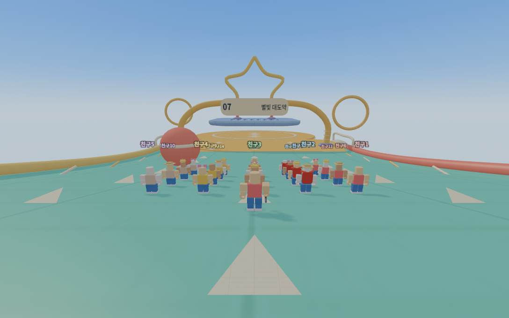

# 74차 — 통통! 구름 운동회

기존 장애물 경주를 7구간의 공기 주입식 하늘 운동회로 교체했다. 원본은 `클로드/index.html`, 배포본은 `클로드/배포용/index.html`이다. 73차 통신·구매·복구·카메라 수정은 유지한다. 새 코스의 충돌과 이동 규칙이 달라졌으므로 교사와 학생 모두 74차 파일로 새 방에 들어가야 한다.

## 플레이

구름 출발광장 → 통통 도넛섬 → 빙글 캔디마당 → 출렁 구름다리 → 붕붕 하늘항로 → 무지개 미끄럼 → 별빛 대도약.

- 21명 출발 자리는 기존의 두 줄 24슬롯에서 씨앗으로 배정한다. 7개 체크포인트에서 개인별 복귀 자리를 분리한다.
- 바운스 매트 중앙의 화살표를 밟으면 85ms 눌림 뒤 자동 발사한다. 작은 바운스, 연쇄 도약, 높아지는 발판, 마지막 큰 도약의 속도와 높이가 다르다.
- 공중에서 좌우 방향을 조절하고 뒤 입력으로 제동할 수 있다. 미끄럼틀에서는 전진할 때 가속하며 입력을 놓으면 감속한다.
- 회전봉은 뛰어넘거나 넓은 바깥쪽으로 우회한다. 움직이는 매트는 위에 선 사람을 함께 옮긴다. 실패하면 마지막 체크포인트로 돌아온다.
- 캐릭터의 옷·머리·모자 배율은 고정하고 관절과 몸 중심으로 비행/착지를 표현한다. 추가 FOV는 최대 4도, 카메라 방향 자동 회전은 없다.
- 기존 90초 제한, 랭킹, 순위별 장비와 완주 보상은 유지한다.
- 같은 매트에 재착지해도 다시 도약할 수 있다. 추락·메뉴 중 경주 시계는 진행하며 교사 일시정지는 따른다. 호스트·손님 모두 마을로 나갈 때 피격 이동 잠금과 도약 상태를 지운다.

## 미술과 비용 관리

쌓은 상자 경주와 주변 장식을 제거하고 두꺼운 타원 쿠션, 둥근 끝의 회전봉, 연속 곡선 슬라이드, 관형 아치와 별 결승문을 만들었다. 비닐 천 패널의 봉제선, 고무 표면, 금속 축·볼트를 사용한다. 겹치는 발판의 윗면은 서로 높이를 달리한다.

불투명 Phong 공유 재질 3개와 512×512 텍스처 2개를 사용한다. 정적 표면은 재질별 버퍼로 합치고 가까운 범위만 그린다. 같은 모형이 움직일 때는 인스턴스를 갱신한다. 경주 전용 메시의 실제 표시 호출은 6~9개, 최대 인스턴스 42개이며 텍스처는 밉맵을 사용한다. 추가 조명·전체 화면 흐림·겹친 반투명 구름·강체 천 시뮬레이션은 없다.

기존 보통 화질의 픽셀비율 .85, 그림자 2048, AA 2와 매 프레임 그림자 갱신을 그대로 유지했다. 해 그림자의 중심 높이는 경주 중 하늘섬 높이를 따른다. 이전에는 마을 바닥 높이에 고정되어 높은 섬의 그림자가 범위 밖으로 빠졌다. 마을로 돌아오면 원래 높이를 사용한다.

## 검사

- `t54-race-static.mjs`: 90개 씨앗의 결정성, 곡면 판정, 21명 출발·7개 체크포인트, 장애물과 복귀 지점 분리, 기본 점프로 회전봉 넘기, 랭킹·보상 22항목.
- `t74-race-view.mjs`: 실제 브라우저의 이동 함수를 3개 씨앗 × 30/60/120Hz로 실행. 7개 매트의 바운스 총 63회, 움직이는 매트 동행 9회, 슬라이드 가속·감속 9회, 전체 코스 완주 9회.
- 전체 경로는 Shift·점프 없이 회전봉 바깥길을 선택해 51.97~52.50초에 완주했다. 추락 0, 체크포인트 7개 통과, yaw/pitch 변화 0. 이는 자동 시험 경로의 시간이며 어린이의 평균 완주 시간은 아니다.
- `t61-avatar-clearance-static.mjs`: 꾸미기 8종·직업 6종, 내 캐릭터·친구, 30/60/120Hz의 비행·착지 8,820프레임. 팔·다리·의상 관통과 NaN 0, 모자 상대변환 오차 1.45e-6 이내.
- 기존 Node 검사 전체 통과. 실제 화면 검사에는 셰이더 오류, 동적 메시 색 속성 누락, 인스턴스 정원 초과도 포함한다.
- 시계·재입장 회귀: 30/60/120Hz의 정상·팝업·추락·정지 12회, 같은 매트 재착지/재발사 3회, 마을 복귀 상태 초기화. 실제 10FPS 프레임 루프에서도 정상·팝업·정지의 호스트 시간과 경주 시간이 일치한다.

검사 이미지는 `artifacts/race74/`, 수치·실제 주행 결과는 `artifacts/race74/race74.json`에 저장한다. `check-current.mjs --browser-smoke` 및 GitHub 자동 검사에서 새 경주도 실행한다.

성능 비교는 같은 21명, 씨앗 740021, 1280×800, 보통 품질에서 기존 73차와 새 코스를 비교한다. 소프트웨어 WebGL의 스크립트 처리 시간은 그램 실기기 FPS가 아니다. 21대 실제 네트워크 수업과 그램 하드웨어 프레임 속도는 별도 수업 환경에서 확인해야 한다.

| 같은 상대 시점 | 기존 73차 렌더 호출 | 74차 렌더 호출 |
|---|---:|---:|
| 출발 | 393 | 142 |
| 중간 체크포인트 | 201 | 60 |
| 결승 | 63 | 58 |

최종 전체 브라우저 검사에서 스크립트 처리 시간(noRender, 360표본)은 중앙값 1.9ms / 95백분위 4.5ms였다. 기준본은 3.1ms / 6.8ms였다. 텍스처는 23→25개, 해상도·그림자 설정은 동일하다. 길이가 달라진 전체 조망 사진은 성능 비교 근거로 사용하지 않았다. [최종 측정·주행 결과 JSON](계획/74차-경주검사결과.json)도 함께 보존했다.
