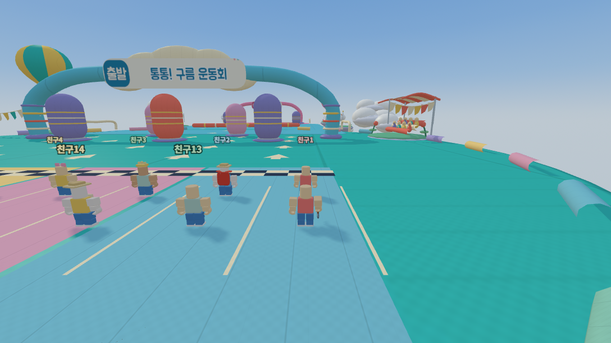

# 75차 — 실제 플레이 화면을 기준으로 다시 다듬은 구름 운동회

74차는 613칸 코스에 충돌 장애물이 4개뿐이고, 첫 회전봉이 출발점에서 약 227칸 떨어져 있었다. 낮은 장외 구름은 넓은 바닥에 가려졌다. 자동 완주 검사와 조망 사진을 미술·플레이 완성의 근거로 잘못 사용했다. 사용자의 실제 출발 화면 지적을 받아 이번에는 **기본 카메라의 출발·주행·7구간 화면을 직접 열어 검수**했다. 넓은 바닥은 사용자 요청대로 유지한다.

## 사용자 요구와 확인한 증거

| 요구 | 구현 | 직접 확인 |
|---|---|---|
| 주변 풍경을 풍성하게 | 곡면 천막과 응원석·관중, 둥근 패널 열기구와 바구니·고정 줄, 공중 잔디섬·큰 구름 무리, 삼각 깃발·바람자루 | 기본 시점 출발 사진과 7구간 사진을 모두 열어 확인. 처음보다 높인 구름이 바닥 위 시야에 보임 |
| 구간마다 실제 장애물 | 캡슐 펀치백·회전봉·구형 범퍼 26개. 7구간 분포 8/3/4/4/2/3/2. 움직이는 다리의 펀치백은 발판과 함께 이동 | 출발 후 23.8칸 앞 장애물, 실제 직진 주행의 충돌, 모든 구간 장애물 존재·캡슐 렌더/충돌 높이 검사 |
| 좋은 바운스는 유지하며 더 빠르게 | 스프링 발사 속도 1.18배, 스프링 비행 중력 1.18²배. 높이·거리 보존, 체공 시간 약 15% 단축. 일반 점프와 마을/서바이벌은 원래 중력 | 실제 이동 함수의 63회 도약·착지. 체공 시간 비율 0.835~0.847, 정점/착지와 카메라 방향 검사 |
| 캔버스의 파스텔·출발선·글씨 | 다섯 색 대기 레인, 두 줄 체크 출발선, 화살표·색 띠, 구름 간판, 둥근 주아 글꼴의 출발/구간/골인 표지 | 간판이 아치에 가려진 첫 시안을 수정한 뒤 기본 카메라로 다시 확인. 외부 폰트 요청을 막고 내장 글꼴 로드와 Canvas 글씨 그리기 검사 |
| 천·고무·금속 디테일 | 직조·봉제선·바늘땀, 둥근 고무 캡슐과 띠·받침, 금속 고정 플랜지·회전축. 표면 고주파는 거리에 따라 완화 | 첫 펀치백 근접 사진, 바운스/회전봉/슬라이드 화면. 금속 받침이 고무에 숨지 않도록 높이를 수정 |
| 미완성 상태를 완료로 보고하지 않기 | AGENTS.md에 요구별 증거·기본 카메라·직접 이미지 검수·성능 비교·미확인 구분을 완료 전 규칙으로 추가. t75를 로컬/CI 브라우저 검사에 포함 | 실제 실행 및 기록. 자동 검사는 미술 판단의 보조이며 직접 이미지 확인을 대체하지 않음 |

추가 수정: 마을 수정 빛기둥이 하늘섬 바닥보다 4칸 높아 경주 화면에 반투명 사각형으로 보였다. 미니게임에서는 숨기고 마을에 돌아오면 다시 보인다. 낮은 새털구름도 경주 중에는 더 높은 하늘로 옮겨 화면 윗부분을 납작하게 덮지 않게 했다.

## 실제 화면

아래 출발 사진은 21명, 실제 씨앗 출발 위치, 기본 게임 카메라다. 비교용 조망 카메라를 사용하지 않았다.

- [출발 2초](계획/75차/race75-run-2s-default-camera-21.png), [5초](계획/75차/race75-run-5s-default-camera-21.png), [10초](계획/75차/race75-run-10s-default-camera-21.png): 실제 키 입력으로 이동. 충돌도 그대로 허용한다.
- [1구간](계획/75차/race75-section-probe-01-default-camera-21.png), [2구간](계획/75차/race75-section-probe-02-default-camera-21.png), [3구간](계획/75차/race75-section-probe-03-default-camera-21.png), [4구간](계획/75차/race75-section-probe-04-default-camera-21.png), [5구간](계획/75차/race75-section-probe-05-default-camera-21.png), [6구간](계획/75차/race75-section-probe-06-default-camera-21.png), [7구간](계획/75차/race75-section-probe-07-default-camera-21.png): 구간 검수를 위해 체크포인트로 이동시킨 보조 사진이다. 카메라는 게임의 기본 추종을 그대로 사용한다.
- [천·고무·금속 근접 화면](계획/75차/race75-material-probe-first-punch-default-camera.png): 재질 검수를 위한 지정 위치. 출발부터 달린 사진과 혼동하지 않는다.

## 검사와 성능 범위

- Node 검사 전체 34파일 통과. t54는 28항목으로 확대했다. 21명 × 7개 체크포인트의 안전, 씨앗 결정성, 캡슐 충돌, 일반 점프와 스프링 중력 분리를 확인한다.
- t74 실제 브라우저: 3씨앗 × 30/60/120Hz, 도약 63회, 연속 완주 9회, 7개 체크포인트. 회전봉 우회 등 명시적 입력 경로는 52.38~52.84초에 완주했고 추락은 없었다. 이것은 어린이 평균 완주 시간이나 재미의 증거가 아니다. 별도 t75의 무계획 직진 경로는 실제 피격을 확인한다.
- t75: 실제 시작 위치와 기본 카메라, 21명 표시, 7구간 장애물, 캡슐 그림/판정 일치, 셰이더 오류·인스턴스 넘침 없음, 오프라인 간판 글꼴 검사.
- 보통 화질의 픽셀비율 .85, 그림자 2048, AA 2, 매 프레임 그림자 갱신 유지. 추가 실시간 광원·반투명 구름·후처리 패스 없음. 경주 전용 공유 재질 3개, 전용 그리기 9회.
- 같은 실제 출발 위치/기본 카메라/21명에서 기록한 한 프레임의 전체 렌더 호출 **214→217**, 그림자 포함 삼각형 **1,322,568→1,353,222**. 풍경과 장애물을 늘린 기하 비용을 숨기지 않는다. 장면에는 움직이는 마을·그림자도 있어 실행별 수치 변동이 있다. 출발 후 사진들은 피격으로 위치가 달라져 동일 시점 성능 비교에 사용하지 않는다.
- 표면/글씨 atlas는 가독성을 위해 512→1024, 요철은 512 유지. 텍스처 개수는 같지만 RGBA 밉맵 환산 전용 용량은 약 2.7→6.7MiB다. 글꼴은 [Google Fonts의 Jua](https://github.com/google/fonts/tree/main/ofl/jua)에서 표지에 필요한 글자만 추려 20,520바이트 WOFF2로 내장했고, OFL 허가문을 HTML에 포함했다.
- 스크립트 측정(noRender)은 소프트웨어 WebGL 환경의 비교 자료다. **LG gram의 실제 GPU FPS, 21대 기기의 실시간 네트워크 수업, 아이들의 체감 난도는 이 환경에서 검증하지 못했다.** 따라서 ‘그램 21대에서 끊김 없음’ 또는 ‘아이들의 재미 검증 완료’라고 단정하지 않는다.
- 최종 기본 시점 검사 noRender 570표본은 중앙값 2.1ms / 95백분위 4.0ms였다(기준본 2.4ms / 6.2ms). 렌더·네트워크를 제외한 반복 측정이라 그램 FPS나 확정적인 성능 향상률로 환산하지 않는다. 전체 브라우저 검사 6파일도 통과했다(교실 복구/구매, 성능, 경주 이동, 실제 시점, 손잡이, 성벽 사격).

측정 원본: [74차 기본 시점](계획/75차/baseline74-playview.json), [75차 기본 시점](계획/75차/race75-playview.json), [75차 이동·도약](계획/75차/race75-physics.json).

상점·상점주인 리디자인 요청은 사용자가 경주 수정을 우선 지시하여 이번 75차 범위에서 보류했다. 상점 외형을 수정했다고 보고하지 않는다.
